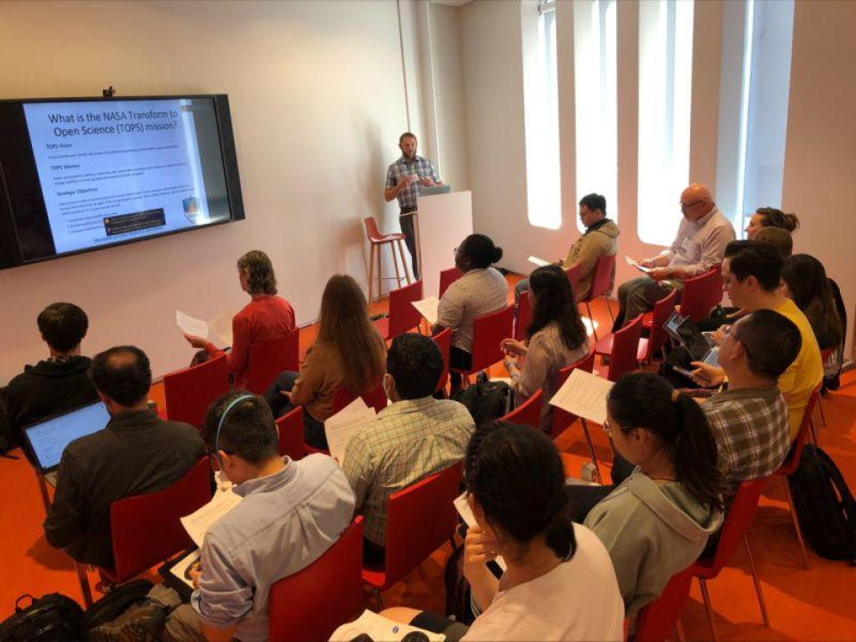

.. Author: Akshay Mestry <xa@mes3.dev>
.. Created on: Saturday, November 23, 2024
.. Last updated on: Saturday, November 23, 2024

:og:title: About Us
:og:description: ...

.. _about:

===============================================================================
About SCHOOL
===============================================================================

.. title-hero::
    :icon: fa-solid fa-circle-info
    :summary:
        ...

.. tags:: topstschool

.. contributors::
    :location: Palisades, NY

    - :name: TOPSTSCHOOL Development Team
    - :email: TOPSTSCHOOL@gmail.com
    - :headshot: https://avatars.githubusercontent.com/u/16084170?s=200&v=4
    - :github: https://github.com/ciesin-geospatial
    - :youtube: https://www.youtube.com/@TOPSTSCHOOL

**Science Core Heuristics for Open Science Outcomes in Learning (SCHOOL)**,
part of the NASA `Transform to Open Science (TOPS) <https://zenodo.org/records/8087116>`_ Training (TOPST) initiative.

===============================================================================

Project Overview
*******************************************************************************
 
:term:`SCHOOL`'s objective is to develop curriculum for ScienceCore that incorporates
NASA Earth Science Applications use cases and data into the data science life
cycle as part of `NASA’s Open Source Science Initiative (OSSI) <https://science.nasa.gov/researchers/open-science/>`_. The project
consists of seven 2.5 hour learning modules designed to fit both online
(self-led) and in person instruction. Modules focus on demonstrating the data
science life cycle with varying themes: **Water, Health and Air Quality,
Environmental Justice, Disasters, Wildfires, Agriculture, and Climate.**
 

#. **Thematic Depth.** Each module explores a critical theme affecting our
   planet, including:

   - **Water.** Understanding water systems in a changing climate.
   - **Air Quality.** Connecting air quality data to public health
     outcomes.
   - **Environmental Justice.** Promoting equitable solutions to environmental
     challenges.
   - **Disasters.** Using data to predict, prepare for, and mitigate natural
     disasters.
   - **Wildfires.** Understanding and managing wildfire risks in vulnerable
     areas.
   - **Agriculture.** Enhancing food security through data-driven
     decision-making.
   - **Climate.** Addressing the urgent challenges posed by climate change.

#. **Data Science Life Cycle Integration.** Modules guide learners through
   the data science life cycle, demonstrating how to analyze, visualize, and
   derive insights from NASA datasets.
#. **Open Science Focus.** By emphasizing :term:`transparency` and
   collaboration, SCHOOL equips learners with the skills to contribute
   meaningfully to the global :term:`Open Science` community.
   

.. _model-structure:

TOPSTSCHOOL Module Structure
===============================================================================

Each 2.5 hour thematic module, broken down into five 30-minute lessons, will
demonstrate the full data science life cycle and connect those processes with
open science principles.

.. list-table::
    :widths: 5 5 5
    :header-rows: 1
    :align: left

    * - Module Component
      - Data Science Life Cycle/Open Science Integration
      - Example Activity

    * - Lesson 1
      - Generation and collection
      - Identify and obtain data sources. Generation could include
        spatializing tabular data.

    * - Lesson 2
      - Processing and storage
      - Data integration tasks are completed. Local and cloud storage options
        are demonstrated.

    * - Lesson 3
      - Management and analysis
      - Creation of metadata to inform uses and structure. Statistical
        techniques applied.

    * - Lesson 4
      - Visualization and interpretation
      - Creation of charts and maps. Interpretation thought questions and
        examples from other work.

    * - Lesson 5
      - Open Science and Community Engagement
      - How to share these results openly. Practice of engaging with existing
        and emerging community networks.

.. _our-pedagogy:

School Pedagogy

-------------------------------------------------------------------------------
Pedagogy
-------------------------------------------------------------------------------

At SCHOOL, we believe that how we teach is just as important as what we teach.
Our pedagogy is rooted in principles of inclusive teaching, active learning,
and thoughtful evaluation. These core values ensure that every learner feels
welcomed, empowered, and supported throughout their educational journey.

Find all of the relevant material for modules and events on the TOPSTSCHOOL
Zenodo `here <https://zenodo.org/communities/topstschool/records?q=&l=list&p=1
&s=10&sort=newest>`_.

.. dropdown:: Inclusive Teaching

    Education should reflect the richness of the world we live in. At
    :term:`SCHOOL`, we strive to create an environment where diversity is not
    just acknowledged but celebrated. Here's how we foster inclusivity:

    - **Breaking Down Barriers.** Course content includes examples that cross
      cultural, gender, and socioeconomic boundaries, ensuring relevance for
      all learners.
    - **Diverse Modes of Learning.** Materials are delivered through a variety
      of methods, including videos, visuals, interactive exercises, and text.
      This multimodal approach ensures that learners with different
      preferences and abilities can engage fully.
    - **Accessible Design.** Every module is crafted to accommodate learners
      from diverse backgrounds and skill levels, eliminating assumptions about
      prior experience.

.. dropdown:: Active Learning

    We want learners to not just consume knowledge but to actively engage with
    it. Active learning encourages students to reflect, analyze, and apply
    concepts in real-time. Here's what you can expect:

    - **Critical Thinking.** Activities are designed to go beyond rote
      memorization, prompting learners to ask why and how.
    - **Engaging Tasks.** Modules include dynamic exercises such as coding
      challenges, data visualization tasks, and discussions.
    - **Interactive Content.** Even in self-led settings, learners are guided
      to interact with content, such as exploring datasets, connecting
      concepts to real-world scenarios, or engaging in problem-solving
      exercises.

.. dropdown:: Thoughtful Evaluation

    Effective learning relies on clear goals and constructive feedback. SCHOOL
    employs a rigorous evaluation process to help learners succeed:

    - **Transparent Expectations.** Learners know from the start what is
      expected and how their progress will be assessed.

    - **Timely Feedback.** Frequent and detailed feedback ensures that
      students can refine their skills as they learn.
    - **Guidance Through Exemplars.** Clear examples of successful outcomes
      help learners aim for excellence.

    Our goal is to create a supportive feedback loop where learners feel
    encouraged and motivated to improve continuously.

.. youtube-video:: https://www.youtube.com/watch?v=GdPvP7Yhx2I&t=1s

.. _why-join-school:

-------------------------------------------------------------------------------
Why Join SCHOOL?
-------------------------------------------------------------------------------

The SCHOOL Project isn't just about education; it's about building a community
of learners and researchers committed to advancing Open Science. By
participating in SCHOOL, you're contributing to a brighter, more collaborative
future for science and society.

- Are you an **educator** looking to inspire your students with real-world
  applications of science?
- Are you a **student** eager to develop skills that will shape your career and
  make a difference?
- Are you a **researcher** passionate about sharing knowledge and fostering
  global collaboration?

If so, SCHOOL is the perfect place for you to make an impact. Together, we can
create a world where knowledge knows no boundaries, and science is accessible
to all.

|getting-involved-link| |chevron-right|

-------------------------------------------------------------------------------
Project Timeline
-------------------------------------------------------------------------------

The SCHOOL Project represents a collaborative journey toward
reshaping how Open Science is taught and learned. Our timeline spans two
years, beginning on **July 1, 2023**, and culminating on **June 30, 2025**,
offering ample opportunities for contributions, feedback, and refinement as we
move forward together.

To ensure the smooth and efficient development of SCHOOL's learning modules,
we are adopting the `Scaled Agile Framework (SAFe) <https://
scaledagileframework.com>`_ methodology. This proven approach emphasizes
collaboration, flexibility, and incremental progress, allowing us to deliver
thematic content regularly and in manageable stages.

-------------------------------------------------------------------------------
Learn More
-------------------------------------------------------------------------------
Find all of the relevant material for modules and events on the TOPSTSCHOOL Zenodo `here <https://zenodo.org/communities/topstschool/records?q=&l=list&p=1&s=10&sort=newest>`_.
