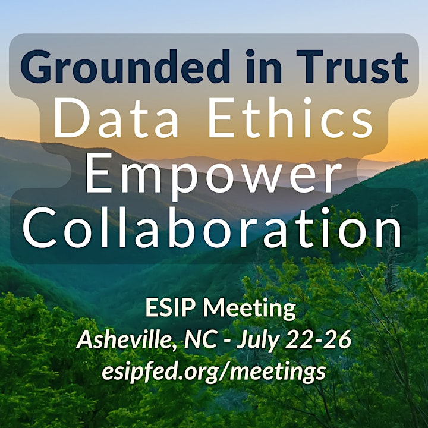
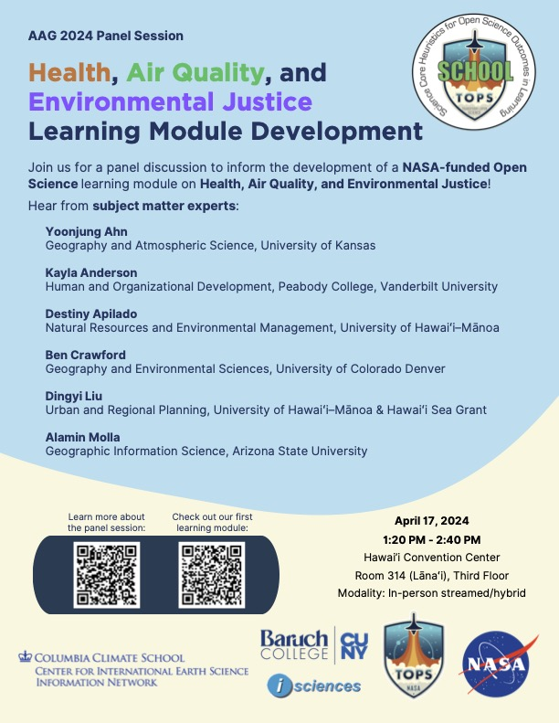

.. Author: Akshay Mestry <xa@mes3.dev>
.. Created on: Saturday, November 23, 2024
.. Last updated on: Saturday, November 23, 2024

:og:title: About Us
:og:description: ...

.. _about:

===============================================================================
About
===============================================================================

.. title-hero::
    :icon: fa-solid fa-circle-info
    :summary:
        Science Core Heuristics for Open Science Outcomes in Learning (SCHOOL), part of the NASA <a href="https://zenodo.org/records/8087116" target="_blank">Transform to Open Science (TOPS) Training (TOPST)</a> initiative.

.. tags:: topstschool

.. contributors::
    :location: Palisades, NY

    - :name: TOPSTSCHOOL Development Team
    - :email: TOPSTSCHOOL@gmail.com
    - :headshot: https://avatars.githubusercontent.com/u/16084170?s=200&v=4
    - :github: https://github.com/ciesin-geospatial
    - :youtube: https://www.youtube.com/@TOPSTSCHOOL

  
Project Overview
===============================================================================

SCHOOL’s objective is to develop curriculum for ScienceCore that incorporates
NASA Earth Science Applications use cases and data into the data science life
cycle as part of `NASA’s Open Source Science Initiative (OSSI) <https://science.nasa.gov/researchers/open-science/>`_. The project
consists of learning modules designed to fit both online
(self-led) and in person instruction. Modules focus on demonstrating the data
science life cycle with varying themes: **Water, Health and Air Quality,
Environmental Justice, Disasters, Wildfires, Agriculture, and Climate.**

Additional Channels 
-------------------------------------------------------------------------------

Continue engaging with the SCHOOL project in these online communities:

*   **SCHOOL GitHub Repo** 
    
    *   .. button-link:: https://github.com/ciesin-geospatial/TOPSTSCHOOL
            :color: primary
            :shadow:

            GitHub Repo 

*   **SCHOOL Zenodo Community** 
    
    *   .. button-link:: https://zenodo.org/communities/topstschool/
            :color: primary
            :shadow:

            SCHOOL Zenodo Community     

*   **SCHOOL YouTube Channel** 
    
    *   .. button-link:: https://www.youtube.com/channel/UCOIrczFd7_ht2bNUQ3qnM8w
            :color: primary
            :shadow:

            SCHOOL on YouTube    

*   **SCHOOL Zotero Library** 
    
    *   .. button-link:: https://www.zotero.org/groups/5638572/topstschool/library
            :color: primary
            :shadow:

            SCHOOL Zotero Library   

Module Structure
-------------------------------------------------------------------------------

Each thematic module, broken down into three comprehensive lessons, will
demonstrate the full data science life cycle and connect those processes with
open science principles.

.. list-table::  
   :widths: 10 15 25   
   :header-rows: 1

   * - Module Component 
     - Data Science Life Cycle |br| Open Science Integration
     - Example Activity
   * - Lesson 1
     - Generation and collection
     - Identify and obtain data sources. |br| Generation could include spatializing tabular data.
   * - Lesson 2
     - Processing and storage
     - Data integration tasks are completed. |br| Local and cloud storage options are demonstrated.
   * - Lesson 3
     - Management and analysis
     - Creation of metadata to inform uses and structure. |br| Statistical techniques applied.
   * - Lesson 4
     - Visualization and interpretation
     - Creation of charts and maps. Interpretation thought |br| questions and examples from other work.
   * - Lesson 5
     - Open Science and |br| Community Engagement
     - How to share these results openly. Practice of engaging |br| with existing and emerging community networks.

 
SCHOOL Pedagogical Approach
===============================================================================

Inclusive Teaching
-------------------------------------------------------------------------------

*   Inclusive teaching fosters an environment where diversity is celebrated and
    reflected in course content.

*   Marginalization of various populations is overcome by using multiple and
    diverse examples crossing gender, cultural, and socioeconomic barriers.
    Course content is designed to provide a variety of modes **(visual,
    textual, interactive)** for content delivery and for student expression
    which is absent of assumptions about student abilities or experiences.

Active Learning
-------------------------------------------------------------------------------

*   The process of encouraging students to not only focus on doing, but also
    to think critically about what they are doing.

*   Active learning engages students through activities such as reading
    discussing, executing code, and writing, in addition to listening
    Evaluations

*   In asynchronous learning environments, active learning strategies move
    beyond listening to prerecorded materials and toward active engagement by
    directing students to do something, such as looking at an image
    interacting with the real world, or retrieving past knowledge.

Evaluations
-------------------------------------------------------------------------------

*   To foster inclusive teaching and active learning, it is critical that

    *   expectations for assessment are clearly communicated
    *   that assessments are timely
    *   that examples of ideal results are presented

*   Clearly defined learning objectives allow instructors to assess metrics of
    student performance, and to provide feedback early and often.

 
Project Timeline
===============================================================================

The project will commence on July 1, 2023 and end on June 30, 2025. Learning
modules will be developed using the SAFe methodology which will allow for the
regular incremental release of thematic content as it becomes available.
 

Events
===============================================================================

Spring 2025
-------------------------------------------------------------------------------

AAG 2025 SCHOOL Climate and Agriculture Panel Session
~~~~~~~~~~~~~~~~~~~~~~~~~~~~~~~~~~~~~~~~~~~~~~~~~~~~~~~~~~~~~~~~~~~~~~~~~~~~~~~~

This session's objective is to hear from Subject Matter Experts (SMEs) in the areas of Climate and Agriculture in order to inform the development of SCHOOL use cases, which will be considered for the online learning modules.

NSF Open Science Workshop
~~~~~~~~~~~~~~~~~~~~~~~~~~~~~~~~~~~~~~~~~~~~~~~~~~~~~~~~~~~~~~~~~~~~~~~~~~~~~~~~

SCHOOL team members presented the project’s open curriculum and training strategy, highlighting interdisciplinary module development and user engagement in the NASA TOPS ecosystem.

Fall 2024
-------------------------------------------------------------------------------

SACNAS NDiSTEM 2024
~~~~~~~~~~~~~~~~~~~~~~~~~~~~~~~~~~~~~~~~~~~~~~~~~~~~~~~~~~~~~~~~~~~~~~~~~~~~~~~~

**Event:** `Unleashing the Power of AI in Open Science: Empowering the Next Generation of STEM Innovators <https://s6.goeshow.com/sachn/ndsc/2024/agenda.cfm?session_key=C57D9655-4E74-EF11-8102-B95C44E1822F&session_date=Thursday,%20Oct%2031,%202024>`_

Presenting SCHOOL’s work on inclusive curriculum development and open science training for underrepresented groups. This panel session aims to engage this vibrant community in a dynamic discussion about the transformative potential of AI within the realm of open science. By exploring the synergies between AI and open science, we can uncover new ways to promote inclusivity, enhance research outcomes, and foster collaboration.

NASA's Chief Science Data Officer, Kevin Murphy, will open with a keynote addressing how NASA is using large language models to advance open science. Panelists will present lightning talks on AI in Open Science - Opportunities and Challenges, Promoting Diversity and Inclusion through Open Science, and Empowering STEM Education: Open Science, AI, and the SCHOOL Initiative. Live Q&A to follow presentations.

Summer 2024
-------------------------------------------------------------------------------

Curso Corto AmeriGEO
~~~~~~~~~~~~~~~~~~~~~~~~~~~~~~~~~~~~~~~~~~~~~~~~~~~~~~~~~~~~~~~~~~~~~~~~~~~~~~~~

La sesión comenzará con una guía de inundaciones repentinas de la OMM. Esta sesión de formación interactiva profundiza en conceptos de evaluación de vulnerabilidad espacial. Esta sesión aprovechará el entorno del portátil JupyterHub para proporcionar una demostración interactiva utilizando métodos y herramientas estadísticas para evaluar riesgos y vulnerabilidades asociados con desastres naturales y factores socioeconómicos. Los participantes obtendrán experiencia práctica en la selección y análisis de una variedad de vulnerabilidades y aprenderán a aplicar estos conocimientos a escenarios del mundo real. Acceda a los materiales del evento `aquí <https://zenodo.org/records/13350477>`_.

The session will begin with a WMO Flash Flood Guide. This interactive training session delves deeper into spatial vulnerability assessment concepts. This session will leverage the JupyterHub notebook environment to provide an interactive demonstration using statistical methods and tools to assess risks and vulnerabilities associated with natural disasters and socioeconomic factors. Participants will gain hands-on experience in selecting and analyzing a variety of vulnerabilities and learn how to apply this knowledge to real-world scenarios. Access the materials from the event `here <https://zenodo.org/records/13350477>`_.

ESIP 2024 Interactive Session
~~~~~~~~~~~~~~~~~~~~~~~~~~~~~~~~~~~~~~~~~~~~~~~~~~~~~~~~~~~~~~~~~~~~~~~~~~~~~~~~

Interactive session at the Earth Science Information Partners (ESIP) July 2024 meeting, discussing SCHOOL Module 3: Disaster and Wildfires.

- `Presentation materials on Zenodo <https://zenodo.org/records/13134698>`_
- `Watch the video on YouTube <https://www.youtube.com/watch?v=GdPvP7Yhx2I>`_

Spring 2024
-------------------------------------------------------------------------------

AAG 2024 Panel Session
~~~~~~~~~~~~~~~~~~~~~~~~~~~~~~~~~~~~~~~~~~~~~~~~~~~~~~~~~~~~~~~~~~~~~~~~~~~~~~~~
Panel session at the Association of American Geographers (AAG) annual meeting, discussing the development of SCHOOL Module 2: Health, Air Quality, and Environmental Justice.

SEDAC Open Science Workshop
~~~~~~~~~~~~~~~~~~~~~~~~~~~~~~~~~~~~~~~~~~~~~~~~~~~~~~~~~~~~~~~~~~~~~~~~~~~~~~~~
**Date:** Tuesday, January 9, 2024  
**Time:** 10 am – 4 pm Eastern Time  
**Location:** Comer Building Seminar Room, Lamont Campus, Columbia University, 61 Route 9W, Palisades NY 10964

Workshop on Open Science hosted by the NASA Socioeconomic Data and Applications Center (`SEDAC <https://sedac.ciesin.columbia.edu/>`_). This event is designed to provide valuable insights, practical knowledge, and collaborative opportunities for researchers who are passionate about open science and the world of data processing for research and applications at the interface of human and environmental systems.

Fall 2023
-------------------------------------------------------------------------------

AGU 2023
~~~~~~~~~~~~~~~~~~~~~~~~~~~~~~~~~~~~~~~~~~~~~~~~~~~~~~~~~~~~~~~~~~~~~~~~~~~~~~~~

Mentors give workshops at AGU. December 11–15, NASA Openscapes Mentors attended the AGU annual meeting and delivered workshops.

- `GitHub Planning Repo <https://github.com/NASA-Openscapes/2023-planning-agu>`_

SCHOOL Water Module, Open Science Team Meeting 1
~~~~~~~~~~~~~~~~~~~~~~~~~~~~~~~~~~~~~~~~~~~~~~~~~~~~~~~~~~~~~~~~~~~~~~~~~~~~~~~~

The first meeting for the SCHOOL Open Science Team Members was held where Open Science concepts and the Transform to Open Science (`TOPS <https://nasa.github.io/Transform-to-Open-Science/>`_) initiative was introduced.

- `Workshop Documents - Water Module <https://doi.org/10.5281/zenodo.10247097>`_
- `OS Meeting YouTube Video (subtítulos en Español) <https://youtu.be/OKAxJqOlhjM>`_

Water Resources SCHOOL Workshop – I-GUIDE Forum 2023
~~~~~~~~~~~~~~~~~~~~~~~~~~~~~~~~~~~~~~~~~~~~~~~~~~~~~~~~~~~~~~~~~~~~~~~~~~~~~~~~

October 4–5, the TOPSTSCHOOL Development Team hosted a workshop at the `I-GUIDE Forum 2023 <https://iguide.illinois.edu/forum-2023/agenda-of-i-guide-forum-2023/>`_.  
**Topic:** ScienceCore Heuristics for Open Science Outcomes in Learning (SCHOOL): Water Resources Module Development.

- `Workshop Documents - I-GUIDE Forum 2023 <https://doi.org/10.5281/zenodo.8432066>`_
- `I-GUIDE YouTube Video (subtítulos en Español) <https://youtu.be/OsZ3xBYNB6Q>`_

.. |br| raw:: html

    